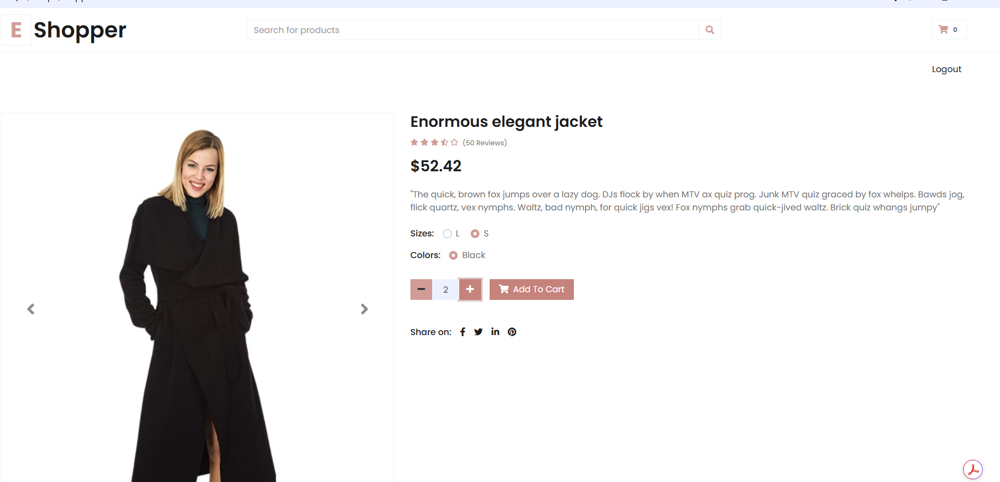
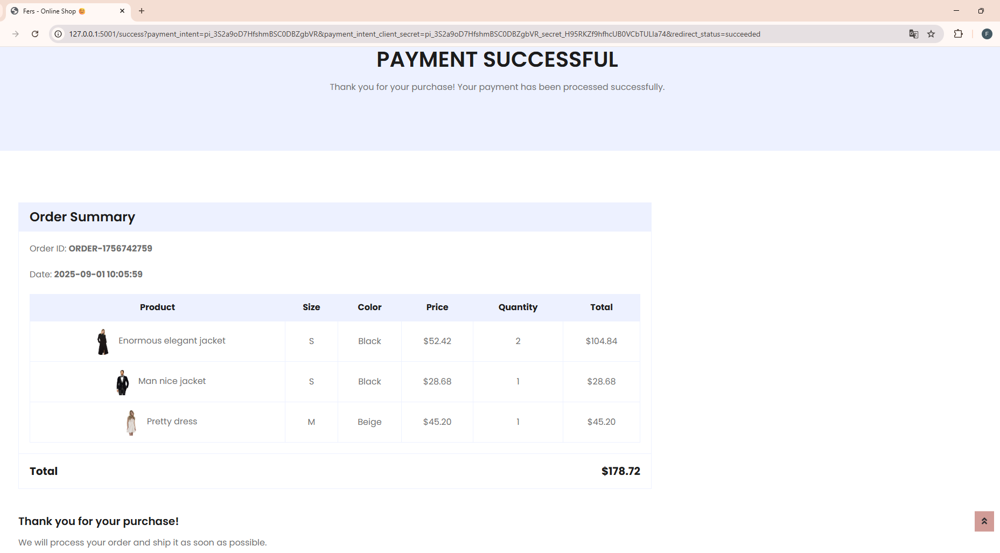

<h1>Day 97 - An online shop:</h1>

An eCommerce website with payment processing.
  Users can browse between all the products available and pick a size and color.
In order to be able to purchase, users must sign up / log in.
Products info is stored and updated in real-time.
Product details and add to cart functionality with Stripe integration for secure payments.
  Tech Stack: Flask, HTML5 Templates, WTForms, SQLAlchemy, REST API, Stripe API

   
  
<h2><b>Website</b> </h2>
<b>Home page:</b> 

<b>Login:</b> 

<b>Product detail:</b> 

<b>Shopping cart:</b> 

<b>Checkout:</b> 

<b>Payment successful</b> with Stripe: 

<b>Declined payment</b> with Stripe: 

<h2><b>Data base</b> </h2>

Product sizes table:

Products table:

Users table with first user as admin and hashed passwords:

